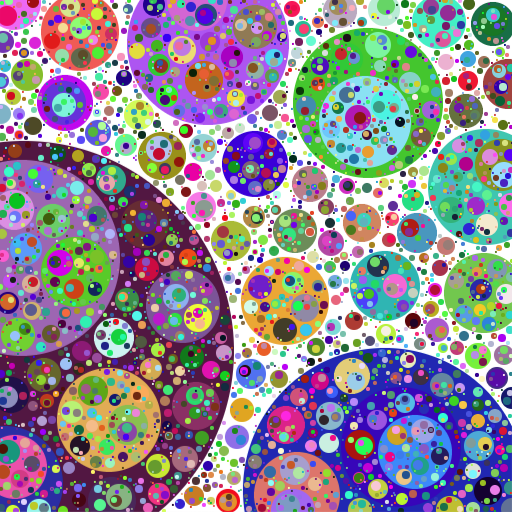

# packing-webgl

## Description
This is the implementation of a simple packing algorithm running on CPU. 

You can zoom anywhere you want by using the left mouse button.

See it live [here](https://piellardj.github.io/packing-webgl/?page%3Acanvas%3Afullscreen=true).

## Details

### Packing
Each new item is given a random position on screen, and then grows without intersecting the others.

The growing part is performed by computing exact the exact intersections between the new item and the others to determine the maximum size possible. The new item is then given only a part of this maximum size.

For better performance (especially when handling 20000+ items), I fraction the canvas into a grid to have a simple spacial indexing. This way, a new item no longer needs to check intersections with every other item, but can simply look at its closest neighbours. This grid adjusts its size from one frame to another so that there is always a constant number of items per cell.

### Display
I first used a Canvas2D context because it is easy to use. However it is extremely slow when drawing a lot of shapes (circles especially, but also trivial ones like rectangles).

I eventually switched to WebGL for better performance. For each frame I reupload to the GPU the whole scene. I could have optimized this part since the geometry doesn't change much from one frame to the other: most items are preserved (they are only stretched by zooming), and the new items are not very numerous. I didn't implemented this optimization because the drawing part is now way faster than the packing part, even with my simple implementation.

The WebGL rendering uses instancing to render the shapes. However it requires an extension that is not always supported, so for devices that don't support it, I have a fallback that uses GL_POINTS and carves the shape by discarding fragments in the fragment shader. It is not perfect because GPUs have a maximum size for GL_POINTS, and it can lead to visual glitches.

To test the renderers I implemented:
- add "webgl=0" in the URL to use the Canvas2D
- in the WebGL version, add "debug=1" in the URL to gain access to a checkbox toggling between instancing/GL_POINTS

### Zooming
The colors are random, in the RGB cube.

When zooming, I need to correctly handle items for performance, so:
- each item that goes out of view is recycled and reinjected at a random position into the view. When zooming, maybe I should favor reinjecting around the focal point, because it is a bit silly to reinject an item near the sceen border when it will disappear in hte next few frames.
- each item that ends up covering the whole screen is also recycled. I just remember its color and use it as a background color from now on. This gives the illusion that we are still zooming into this item.

If someone zooms just at the border of an item, this item ends up covering half the screen and in theory can never be recycled because it stays in view and never covers the whole screen, so it grows indefinitely. However, I encountered visual glitches with gigantic items, due to insufficent floating point precision during the rasterization process. This is why I chose to recycle any item that goes beyond a certain size.

### Testing
I discovered a useful trick during this project.
I needed to test the private method of a class (in theory only public methods should be tested but...). I found 2 ways to do this:
- either cast the object to 'any', but then you lose type checking
- or use bracket notation to call the method. This way, at compile-time Typescript checks that the provided arguments match the method signature :). However this is not a perfect solution, because the compiler doesn't warn you if the method doesn't exist, so it is not rename-safe.